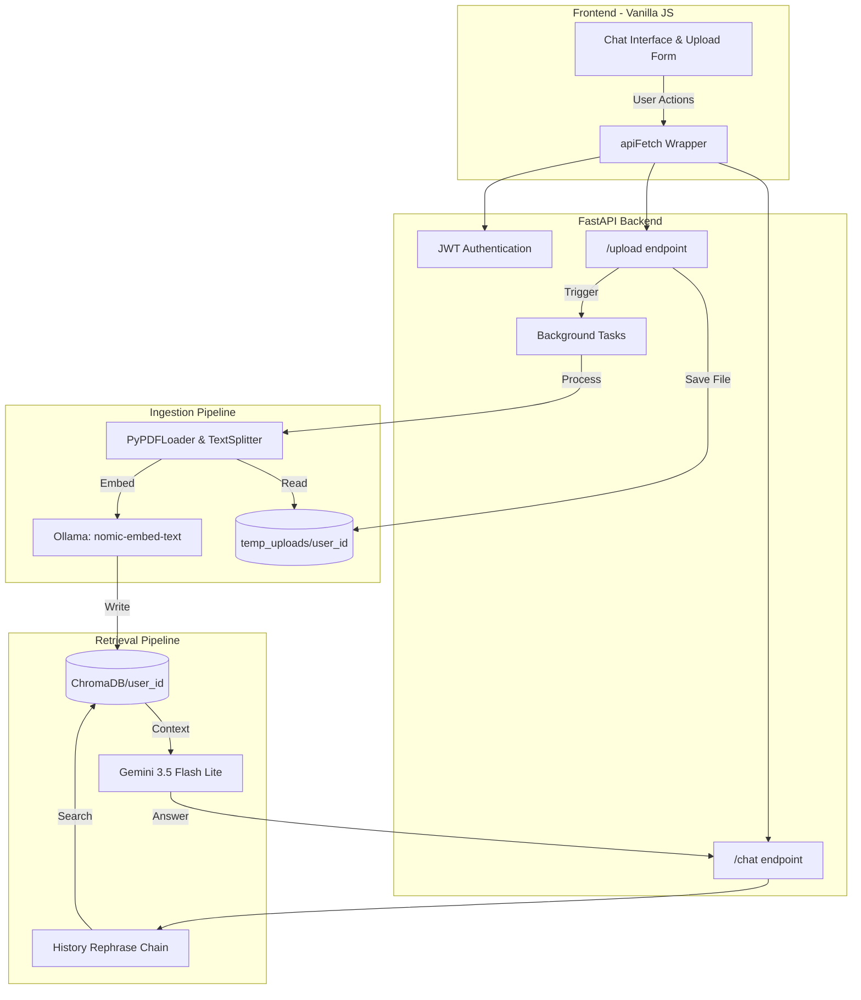

# Multi-Tenant AI Document Concierge

## Overview
A full-stack, multi-tenant Retrieval-Augmented Generation (RAG) SaaS application. This system allows authenticated users to upload PDF documents, processes them via background threads, and enables contextual AI Q&A using a locally hosted vector database isolated by user identity.

## Architecture & Data Flow

The application strictly separates the UI, API, and background machine learning workloads to ensure high responsiveness:
*   **Frontend:** Vanilla JavaScript utilizing `FormData` streams and JWT-based authorization.
*   **Backend:** FastAPI managing authentication, file persistence, and background task queues.
*   **Ingestion Pipeline:** LangChain `PyPDFLoader` and `RecursiveCharacterTextSplitter` chunking data into an immutable user-specific `ChromaDB` partition.
*   **Embedding Engine:** Local inference via Ollama (`nomic-embed-text`) preventing external API timeout constraints during heavy document ingestion.
*   **Generation Engine:** Gemini 3.5 Flash Lite combined with a contextual conversation history rephraser for highly accurate similarity search retrieval.

## Core Features
*   **Strict Multi-Tenancy:** Vector databases are partitioned by immutable integer User IDs, ensuring data privacy across different accounts.
*   **Asynchronous Processing:** Document chunking and embedding are handed off to FastAPI `BackgroundTasks`, preventing HTTP timeout errors on large PDF uploads.
*   **Secure Authentication:** Native `bcrypt` password hashing and environment-managed JWT state handling (avoiding deprecated `crypt` dependencies).
*   **Context-Aware Retrieval:** Implements a dual-chain LangChain architecture that rephrases follow-up questions based on chat history before querying the vector store.

## Prerequisites
*   Python 3.10+
*   [Ollama](https://ollama.com/) installed and running locally.
*   Google Gemini API Key.

