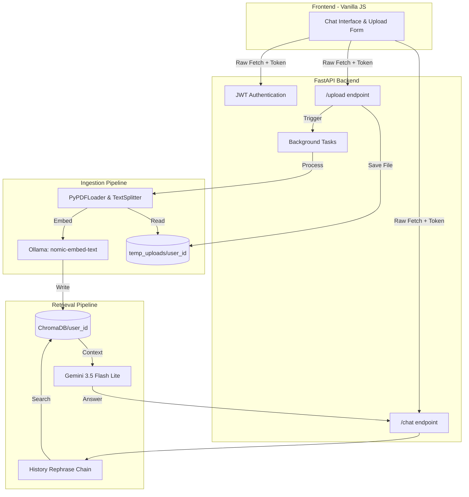

# Advanced RAG SaaS Pipeline

A full-stack, multi-tenant Retrieval-Augmented Generation (RAG) SaaS application. This system allows authenticated users to upload PDF documents, process them via background threads, and engage in contextual AI Q&A using a locally hosted vector database strictly isolated by user identity.

## Video Demonstration

Watch the system architecture and application workflow here:

https://github.com/user-attachments/assets/c494b1ae-d0e7-4f5f-bb77-37012484bbb7

## System Architecture

## Core Features

* **Strict Multi-Tenancy:** User data is physically isolated at the file system level (`chroma_db/{user_id}` and `temp_uploads/{user_id}`) to prevent cross-contamination.
* **Asynchronous Processing:** Document chunking and vector embedding are offloaded to FastAPI `BackgroundTasks` to ensure a non-blocking UI during file uploads.
* **Idempotent File Ingestion:** The application layer intercepts duplicate file uploads to prevent vector duplication and ChromaDB corruption.
* **Secure Configuration:** Sensitive environment variables (`.env`) and local user databases are globally shielded via a root-level `.gitignore`[cite: 3].
* **Global Error Routing:** Network requests are wrapped to automatically handle JWT injection, session expiration (401), and bad requests (400).

## Tech Stack

* **Backend:** FastAPI, Python
* **Frontend:** Vanilla JavaScript, HTML, CSS
* **Vector Database:** ChromaDB (Local SQLite)
* **Embeddings:** Ollama (`nomic-embed-text`)
* **LLM:** Gemini 3.5 Flash Lite (Contextual Retrieval)
* **Framework:** LangChain

## Local Setup

1. Clone the repository and navigate to the project root (`AdvancedRAG-master/`)[cite: 3].
2. Create a virtual environment: `python -m venv venv`
3. Install dependencies: `pip install -r requirements.txt`
4. Create a `.env` file in the root directory and add your `GOOGLE_API_KEY` and `JWT_SECRET_KEY`.
5. Start the backend server: `uvicorn main:app --reload`
